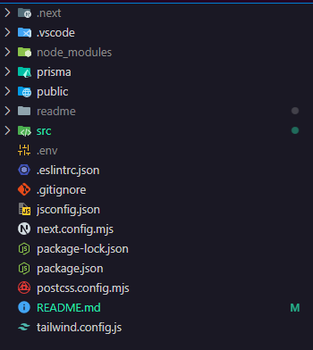

# Run and Build the App

To run the app, follow these steps:

1. Open your terminal.
2. Navigate to the project directory.
3. Run the following command to install the project dependencies:

   ```
   npm install
   npm run build
   npm run start
   ```

## File Structure

Here is the file structure of the project:



- Prisma : prisma scheme
- Src : all the source code
- .Env : for all the keys and DB url
- next.config.mjs : for next-js all the configuration
- tailwind.config.js : for tailwind all the extended css and plugins
- package.json : all the project dependencies , versions and scripts

Inside the src folder, you will find the following files:


- app: contains all the pages
- assets: contains all the assets
- config: contains all the config
- services: contains all the services
- helpers: contains all the helpers
- customHooks: contains all the custom hooks
- middlewares.js: contains the middlewares for web panel

Inside the app folder, you will find the following files:


- api: contains all the api
- layout: is the main layout of the application
- dashboard: contains all the dashboard pages and UI elements
- favicon.ico: have the favicon
- page.js: have login page ui and component with validation and functions
- global.css: contains all the global css with tailwind config imports

Inside the api folder, you will find the following files:


- admin: contains all the admin api

  - auth: contains all the auth api for admin
  - addUser: contains all the add user api for admin
  - allUsers: contains all the get user api for admin

- mobile: contains all the mobile api
  - allUsers: contains all the get user api for mobile
  - auth: contains all the auth api for mobile
  - dcp: contains all the dcp api for mobile (FIXME: need to update - have add s3 bucket )
  - forget_password: contains all the forget password api for mobile
  - give_and_ask: contains all the give and ask api for mobile
  - user: contains all the user api for mobile

Inside the api folder, you will find the following files:


- userDetails.jsx : have userDetails component ui 
- userTable.jsx : have userTable component ui
- addUser.jsx : have addUser component ui
- page.jsx : have dashboard page ui and component bind.